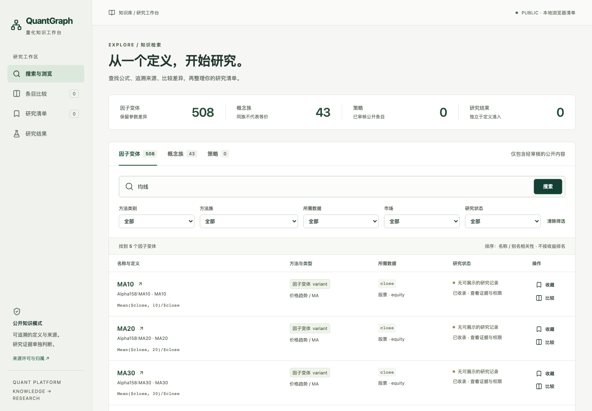
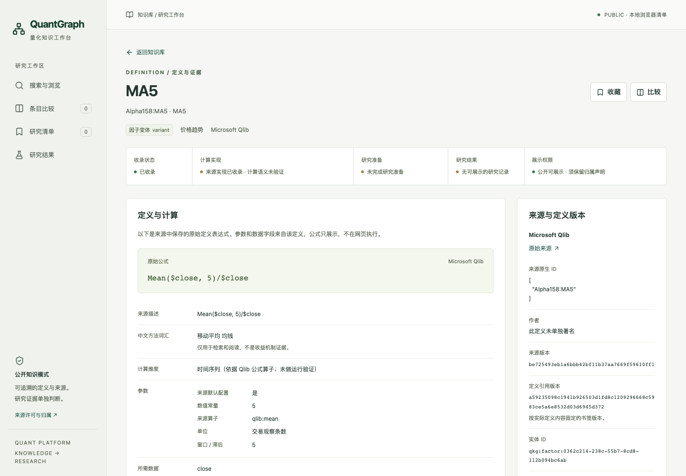
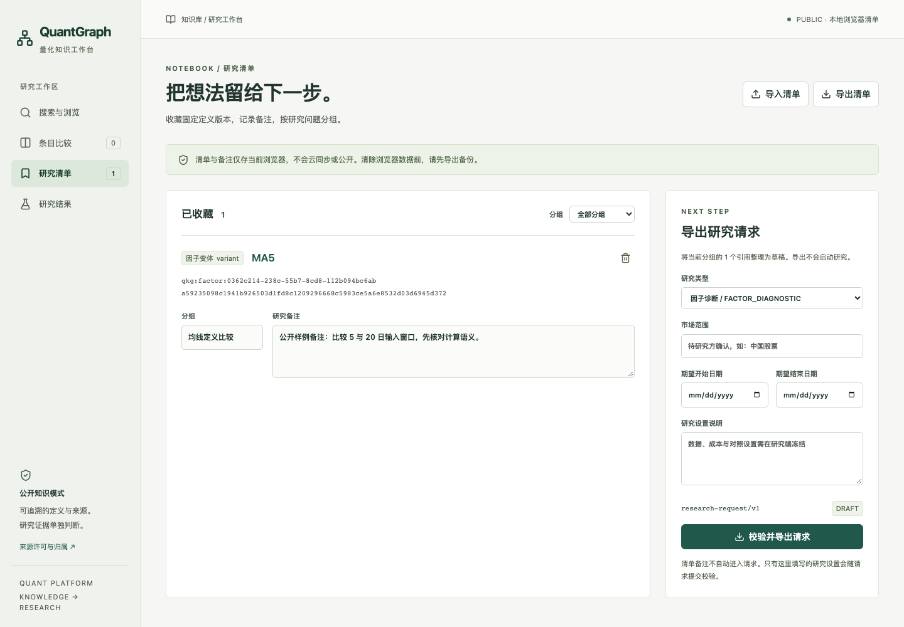
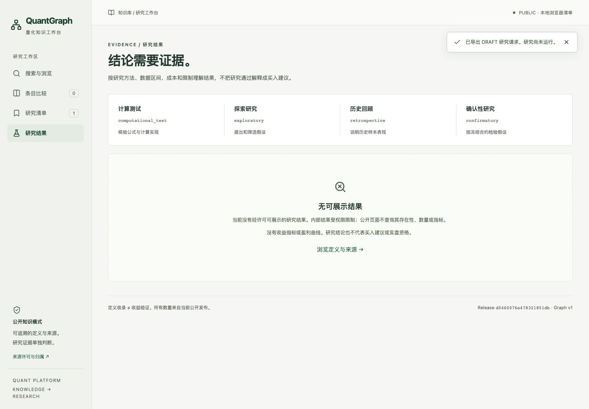

# QuantGraph / Lab 集成验收

本轮只修补接线，不改变因子算法、准入、holdout 或统计核心。公开定义仍来自经许可审查的 Qlib release；生产路径没有 mock。下面的状态只代表本轮实际执行，不借用 A 的历史运行作为本轮结果。

## 固定依赖

2026-09-28 查询 GitHub：下列四个 PR 均 OPEN、未合并，head 上的 push 与 PR CI 均 SUCCESS；B 为 draft。

| 任务 | PR | 固定 head |
|---|---|---|
| A Graph | [#10](https://github.com/KathenZK/quant-knowledge-graph/pull/10) | d22609f4789df1ef9362135bbad2aef1772227be |
| A Lab | [#14](https://github.com/KathenZK/quant-research-lab/pull/14) | e6b3e2a195180a42bf4864040afb65e392ac694f |
| B Web | [#9](https://github.com/KathenZK/quant-knowledge-graph/pull/9) | 3c2a5abe450ecb2cbfdf71409c7eb503f0996f6a |
| C Integrity | [#15](https://github.com/KathenZK/quant-research-lab/pull/15) | 9ef7b825157f346fb9e3cef93283952fdeeff8e4 |

Graph 在新独立 worktree 合并以上 A/B 固定 commit；Lab 在新独立 worktree 合并 A/C 固定 commit。只进行了本机分支合并，没有合并 GitHub PR、修改 main 或使用其他任务未提交代码。Graph 公共注册冲突只保留两边可选参数，并确保 PUBLIC 不注册或加载私有研究 journal。

## 修复与边界

- B 的导出按钮原先关闭。现在用 A 的 ResearchRequest 生成正式 DRAFT，用 definition_identity 固定变体版本；不另建 schema。
- Lab 从原始 DRAFT 和独立审阅的设置生成 selection，再由原 freeze 完成准入。保存原请求，明确冻结后的设置，拒绝类型、版本和范围冲突。
- A 原先使用 UnavailableTrialAdapter。现在薄适配到 C TrialRegistry：planned → started → completed/failed，保存全部定义×期限尝试和真实登记时间，历史完整性 UNKNOWN。FactorStudyResult 保留 C assessment 及可追溯 artifact 摘要。
- 因子相关性不输入 DSR/PBO；明确 NOT_APPLICABLE。已观察的历史数据不得获得确认性 PASS，研究状态仍为 EXPLORATORY_RETROSPECTIVE。
- 私有结果只通过显式本机 --private-study-journal 入口读取，所有内部使用权利必须 ALLOWED。PUBLIC 既不打开私有 journal，也不暴露存在性、数量、关系或指标。通用权限提示不依赖内部数据库。
- PUBLIC/PRIVATE 清单存储键和导入模式分开；请求不会携带浏览器清单备注。旧 B 的 sha256: 书签不能静默当作 A 正式版本，必须核对后重新收藏。

## 重跑入口

先安装各自锁定环境和前端依赖，Lab 显式安装此 Graph SDK，不共用虚拟环境。Node 22+，Playwright 浏览器安装到本 worktree 的 web/.artifacts/browsers。

```sh
# Graph worktree
uv sync --frozen --extra test
npm --prefix web ci
npm --prefix web run build
PLAYWRIGHT_BROWSERS_PATH="$PWD/web/.artifacts/browsers" node web/node_modules/@playwright/test/cli.js install chromium
# Lab worktree
uv sync --frozen --extra dev --extra ml
uv pip install --python .venv/bin/python -e ../quant-knowledge-graph
```

两个仓库必须已提交且工作区干净。私有 input-lock.json 的 manifest / acquisition_contract 各包含绝对 uri 与已冻结 sha256；可附 exposure_ledger 路径。该文件及原始行情不进入公开 Git。用现有 materialize 重新审计原始 capture 后才生成 manifest，不手改任何 acceptance 标记。

```sh
bash web/integration/replay.sh /absolute/integration/quant-research-lab /absolute/private/input-lock.json
```

脚本启动独占的 PUBLIC 8778 / PRIVATE 8779，实际浏览器搜索 MA5、查看来源/版本、收藏、刷新、下载 DRAFT，再显式调用 Lab。验证登记时间顺序、真实因子值、结论级别、同实体版本读回、公开隔离和浏览器错误，保存逐步 acceptance.json。输出为新的 web/.artifacts/integration/时间戳；结束时停止自身服务。不会启动其他执行系统。只有公开页截图被保存，不抓取私有统计页。

同一份已有计划的 run 恢复应复用 TrialRegistry 和 run ID；整条重跑会产生新 request/plan/run，并记录它是同一历史输入的再次观察，不能当作新 holdout。

## 验证状态

- Graph 全量公开可运行测试：172 passed / 24 skipped（私有快照未分发）。build-public、verify-public 通过，公开 release 与数量未改变：508 变体、43 概念、0 策略。
- 前端 lint、typecheck、build、格式通过，26 单元测试和 6 组真实 Chromium E2E 通过。E2E 包含实际 DRAFT 下载、页面错误、中文/英文/别名、损坏存储、XSS、键盘、WCAG AA 自动检查及 390px 窄屏。
- Lab 相关 72 项测试、完整非本机数据测试 2236 passed / 1 skipped / 264 deselected 及治理 preflight 通过；未用这些合成测试冒充真实行情研究。
- PUBLIC 与含合成私有 sentinel 的隔离测试覆盖搜索、统计、详情、关系、结果、错误和 profile 绕过。私有入口能读回 fixture，仅作为隔离测试证据。
- 全私有 validate-release 未完成：此隔离 worktree 缺少锁文件要求的 330 个私有来源输入，在来源核对处失败；不降低门槛。
- 真实行情链路尚待本轮执行，不能据此声明最终成功。已验收原始行情只存在于另一任务的不入 Git 数据目录，需明确本轮输入复用范围后固定字节和重新审计。重跑工具对缺失或摘要变化的输入拒绝运行。

## 本轮已导出的真实请求

浏览器实际下载并通过权威 JSON Schema 校验：

- request_id：`web-d4b43706dabb4428be66625c52ed8152`
- FactorVariant：`qkg:factor:0362c214-238c-55b7-8cd8-112b094bc6ab`（MA5）
- definition_revision：`a59235098c1941b926503d1fd8c1209296668c5983ce5a6e8532d03d6945d372`
- 来源：Qlib `be725493eb1a6bbb42bf11b37aa7669f59610ff1`，原始公式 `Mean($close, 5)/$close`。
- run_id：尚未生成，不能用 A 的旧 run_id 替代此次请求。

| 步骤 | 本轮状态 |
|---|---|
| 1 启动网页 | PASS，独立服务、真实公开 release |
| 2 搜索公开因子 | PASS，中文/英文/原生别名 |
| 3 定义、来源、版本 | PASS，实际 MA5 |
| 4 清单、刷新、请求导出/schema | PASS，以上 DRAFT |
| 5 准入及冻结 | PENDING，待冻结本轮真实行情输入 |
| 6 TrialRegistry 登记真实实验 | PENDING，合成回归通过不计真实登记 |
| 7 真实因子计算及研究 | PENDING |
| 8 FactorStudyResult | PENDING |
| 9 Graph 回写 | PENDING，幂等/权限合成回归通过不计真实回写 |
| 10 同详情页研究结果或权限提示 | 通用公开权限提示通过；本轮真实私有结果尚未验证 |

安全截图只包含公开定义和明确标记的测试备注：

| 搜索 | 详情 |
|---|---|
|  |  |

| 清单及导出 | 公开权限提示 |
|---|---|
|  |  |
