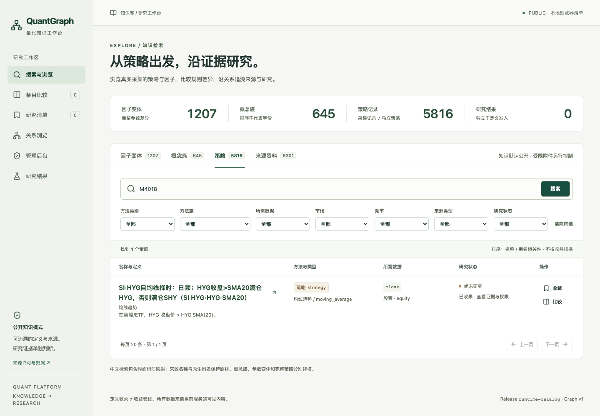
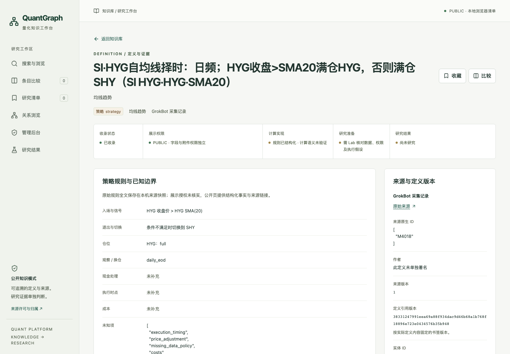
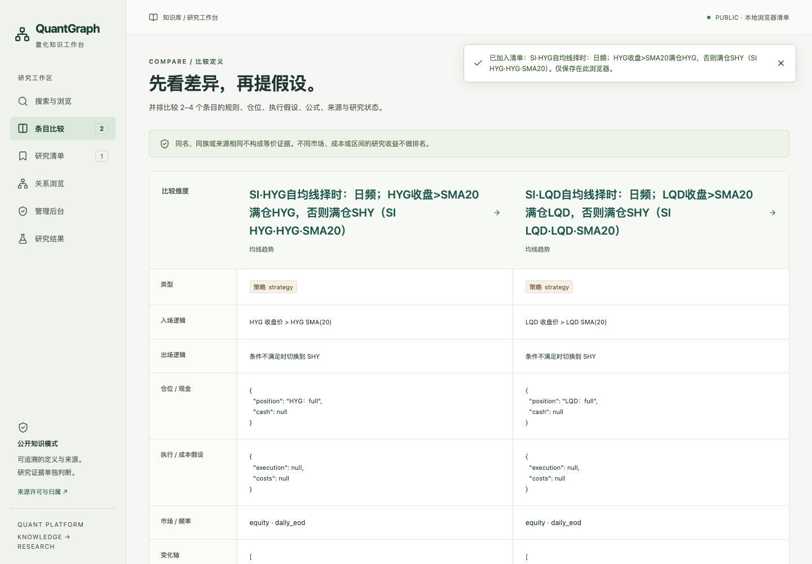
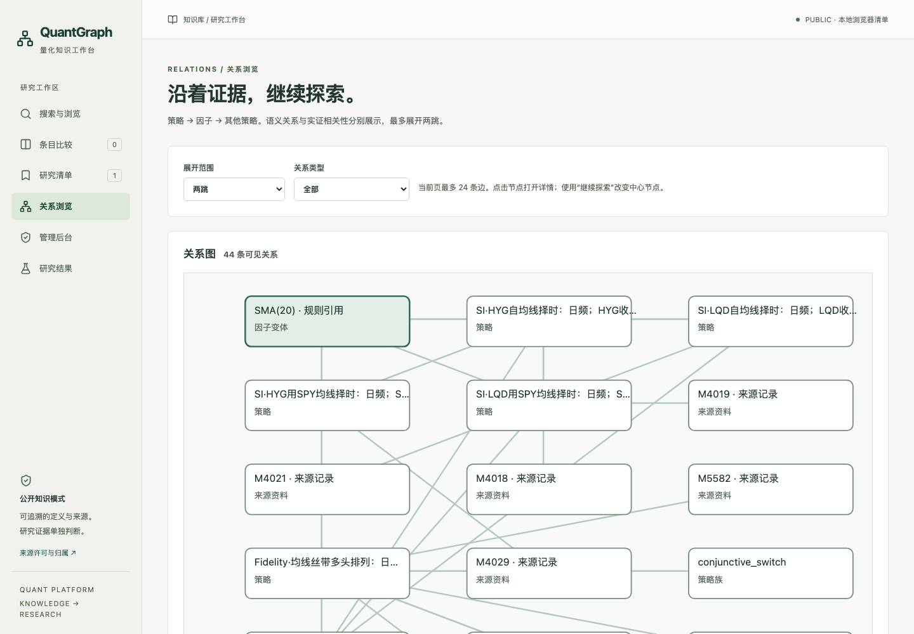
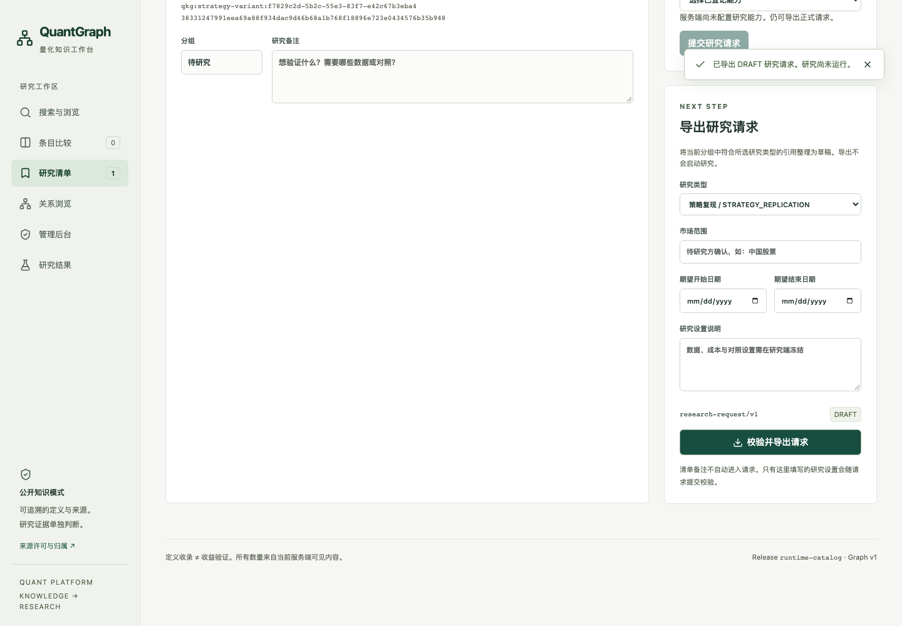
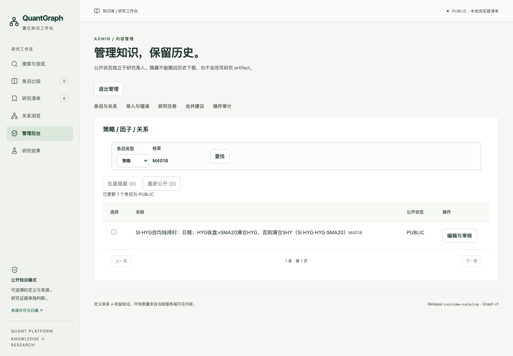
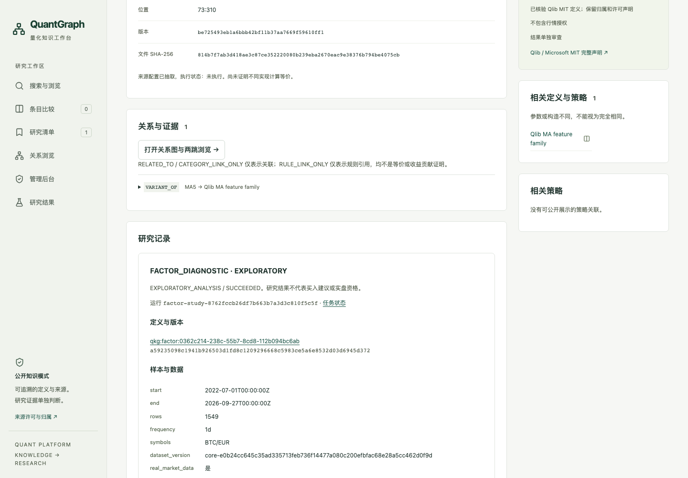
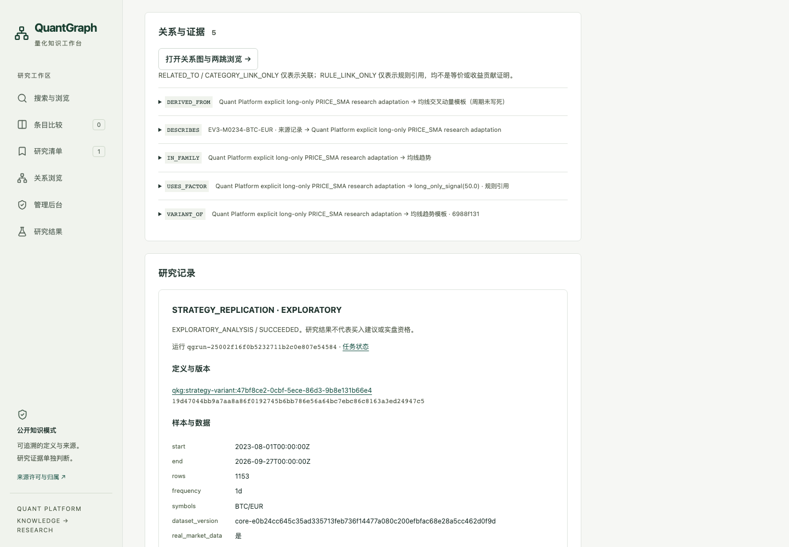

# 策略产品验收记录

2026-09-28，A 在自己的集成 worktree 验收实际已采集语料。本页只发布安全汇总与公开页截图，不附原始语料、私有数据库、市场数值或密钥。最终产品共用 [Graph PR #12](https://github.com/KathenZK/quant-knowledge-graph/pull/12)，研究依赖为 [Lab PR #17](https://github.com/KathenZK/quant-research-lab/pull/17)，本轮不自动 merge。

## 固定版本及输入

A 产品主干基于 Graph `db52163d53bf4c7763e27012995b516296e4544f`；核心真实浏览器研究在 Graph `aca81c7` 的代码组合与 Lab `a066b0670ad1483a29e23c5383cd0f4d23887213` 上通过。之后的显示、索引重建与集合入口修复独立回归。C 集成同一固定版本和 A 产品提交，最终 head/CI 以 PR 当前检查和交接 `A/status.json` 为准。

所有可访问来源都有去向：

| 输入/投影层 | 实际数量与去向 |
|---|---|
| 原 GrokBot archive | 5,813 条，来源锁保留原文件摘要 |
| 已存在的明确研究适配 | 3 条，保留父来源与 DERIVED_FROM，非原来源作者认证 |
| 当前 GrokBot 记录 | 5,816 = 263 结构化可展示变体 + 5,553 待补充来源记录；投影失败 0 |
| normalized 因子来源 | 1,578 = 1,093 精确来源 ID 合并引用 + 485 原始资料引用；不靠模糊名称合并 |
| 已 curated 因子节点 | 1,690 = 551 许可定义节点 + 1,139 仅元信息节点（含概念和变体） |
| 运行时公开 Catalog | 5,816 策略记录、35 方法族、75 模板、1,207 因子变体、645 因子概念、6,301 来源资料节点 |

这些是不同层的数量，不能相加当“独立策略数”。1,207 因子变体包括 1,085 curated 变体和 122 个规则引用；未取得独立定义证据的规则引用不会冒充 canonical 因子。Qlib-only 发布快照的 508 变体、43 概念仍作为隔离回归场景，不作为整个产品的验收基线。

同一 A 快照可见关系共 8,602 条：DESCRIBES 5,816、VARIANT_OF 1,545、CATEGORY_LINK_ONLY 465、USES_FACTOR 296、IN_FAMILY 275、ASSET_VARIANT 118、PARAMETER_VARIANT 84、DERIVED_FROM 3。节点两端必须可见，分页前过滤。没有将同族/规则引用解释为数学等价或收益归因；没有伪造实证相关性关系。

## 用户路径与测试

| 验收 | 结果 |
|---|---|
| 真实策略搜索→详情→参数/资产变体比较→因子→反查策略 | PASS，实际 M4018 及其同族 HYG/LQD 条目 |
| ≥50 个真实策略详情与 ≥5 方法族 | PASS，58 个；absolute_momentum、ATR、RSI、moving_average、relative_momentum_rotation |
| 三类真实关系图/列表、节点跳转、一/两跳 | PASS；24 条/页，服务端上限 100 |
| 清单收藏/取消/分组/备注/刷新/导入导出 | PASS，正式 research-request/v1 DRAFT，不写成研究已执行 |
| 新 ingestion 批次→自动索引、重复批次、规则修订、失败重试 | PASS，既有导入协议；故障测试 fixture 不计真实业务数量 |
| 后台编辑、批量隐藏/重新公开、关系审核、审计 | PASS，直接 URL、导出、反向关系、结果、数量不能绕过 |
| 损坏存储、无效导入、XSS/非法链接、API 失败、无结果/无效 ID/分页 | PASS |
| 键盘、表单标签、WCAG 2 A/AA 与 2.1 AA 自动检查、390px 窄屏 | PASS，无关键浏览器 console/network error |
| 因子/策略/演化网页提交→实际研究→原条目 | PASS，3 个真实 worker E2E，无 mock 结果 |
| PUBLIC/PRIVATE 结果权限 | PASS，匿名只有获准摘要与数值限制；内部结果需管理会话 |

前端 lint/typecheck/build 通过；27 个单元测试、6 个 Qlib E2E、4 个实际 Catalog E2E、3 个真实研究 E2E 通过。受影响 Graph 回归 48 项通过，Catalog 后续重建保护回归 10 项通过。完整 `build-public`、`verify-public`、`validate-release` 通过；全量私有输入已按 source_lock 核对，确定性重建通过，该检查批次为 213 passed / 1 skipped。后续集成检查见 PR CI，不以本页旧数字覆盖新增测试。

## 本轮真实研究对应关系

所有请求来自网页，以正式模型校验；Lab 按登记能力准入、冻结、TrialRegistry 登记后计算，Graph 自动写回。没有手改数据库状态。数据是获内部研究许可的真实 Bit2Me BTC/EUR 日线，非合成行情。历史暴露已知，结论均为探索性，不能升级为确认性验证。

| 类型 | request_id | 持久任务 / run identity | 实验与结果 |
|---|---|---|---|
| 因子诊断 | web-7d608d1b03424a2eb66e18adcb55e174 | job-eef4e46af8d1423eb07ab3dc5be5d507 | 2 trials，1 FactorStudyResult；result run `factor-study-8762fccb26df7b663b7a3d3c810f5c5f` |
| 策略复现 | web-52843960b6204d0f972d3a4b301c6b86 | job-a65d41acb89843febf0fd9b1f1f13359 | 6 trials（含对照），3 可关联结果 |
| 策略演化 | web-ab09e20ac1ac4463806348d679de908b | job-7490fef2be87434893c642a8d4eb8278 | 9 trials（父、子与对照），6 可关联结果 |

因子：`qkg:factor:0362c214-238c-55b7-8cd8-112b094bc6ab`（MA5）；定义版本 `a59235098c1941b926503d1fd8c1209296668c5983ce5a6e8532d03d6945d372`。

策略：`qkg:strategy-variant:47bf8ce2-0cbf-5ece-86d3-9b8e131b66e4`（已采集的 EV3-M0234-BTC-EUR 明确研究适配）；定义版本 `19d47044bb9a7aa8a86f0192745b6bb786e56a64bc7ebc86c8163a3ed24947c5`。

TrialRegistry 实际保存 3 campaign、17 planned attempts、17 started、17 completed，共 54 条追加登记事件。API 结果保存各自原始研究 run ID、定义版本、样本、限制与 artifact 引用。请求导出、任务成功、统计结果和公开展示权限分别判断。重新执行会登记新的历史观察，不能当作新 holdout。

## 截图

均为实际运行页面，只包含安全知识投影和获准的研究元信息。管理截图没有密码或原始语料；内部数值和学习报告未截图。

| 策略目录 | 策略详情 |
|---|---|
|  |  |

| 策略比较 | 三类关系浏览 |
|---|---|
|  |  |

| 研究清单 | 管理后台 |
|---|---|
|  |  |

| 因子真实研究记录 | 策略真实研究记录 |
|---|---|
|  |  |

[390px 窄屏截图](platform-screenshots/07-narrow.png)

## 仍需人工处理

补足尚未结构化记录的来源规则与执行假设；审核受限附件和衍生数值公开权利；为更多定义/市场登记真实研究能力；为公网部署配置域名、TLS、访问控制并管理凭证。没有“已上线”或“可实盘”的声明。已有 B 研究集合由 C 的校验导入入口接入，保持原始 run/版本/结论，不通过新登记伪造旧实验的事前注册。
