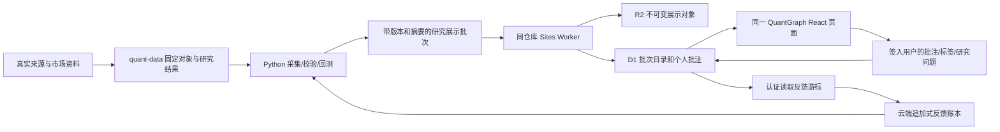

# QuantGraph 数据与批注流

QuantGraph 是公开资料整理、基础/筛选回测和标记平台，当前主要服务单用户；未来 to C 不代表本次开放访问。它也是同一套产品源码。React 页面、固定引用合同、资料查询、增量同步、批注持久化和 Sites 构建均在此仓库维护。Sites 是部署目标。Python 继续承担采集、清洗、研究与本地 API；轻量 Worker 不运行 Python 回测。感兴趣的策略才进入 quant-research-lab 深入研究；quant-runner 用于实盘。基础筛选回测属于 Graph 流程，可以由云端 Python 执行，不要求先迁入 Lab。本改动不增加 runner 或实盘交易。

quant-data 是助手云端数据湖，避免依赖用户本地电脑，保留采集原件和结果的权威版本，GitHub 只保存应用代码与合成测试，Sites 是用户批注的权威存储。R2 只保存展示需要的不可变负载，不要求复制整个数据湖。D1 的激活指针只在全部声明对象的长度、SHA256和引用身份核对后切换。新批次不改写旧回测。

一次页面阅读固定一个快照。批注绑定原始实体和定义版本；结果批注再固定 origin run、variant 和 manifest。来源ID关联不自动证明定义等价。编辑带期望修订号和幂等键；过期修订返回冲突，草稿保留，由用户比较后决定。旧定义缺失时明确显示缺失，不导出新规则顶替旧笔记。

浏览器写操作需要 Sites 提供的真实签入身份及同源校验。服务同步走已确认 owner-private 的平台认证边界，不制造用户身份。未来开放分享需要先重新设计服务授权，本次不改变受众。浏览器原有笔记通过明确导入操作迁移，原件、备份和冲突逐项保留。

部署后的验收须区分：代码/事务测试、真实资料上传并激活、真实签入用户的表单保存与跨会话读取、反馈落入云端账本。只有后两步实际发生，才能声称用户批注的端到端闭环已验证。服务回执中的“已接收”不代表研究已完成。

当前实现使用完成批次后的显式上传和显式反馈拉取；不宣称已有无人值守实时同步。后台周期需要另行完成受支持的调度与认证验证。源码约束和命令见 `sites/README.md`，本次各部署状态与私有验收回执保留在私有运行环境。
