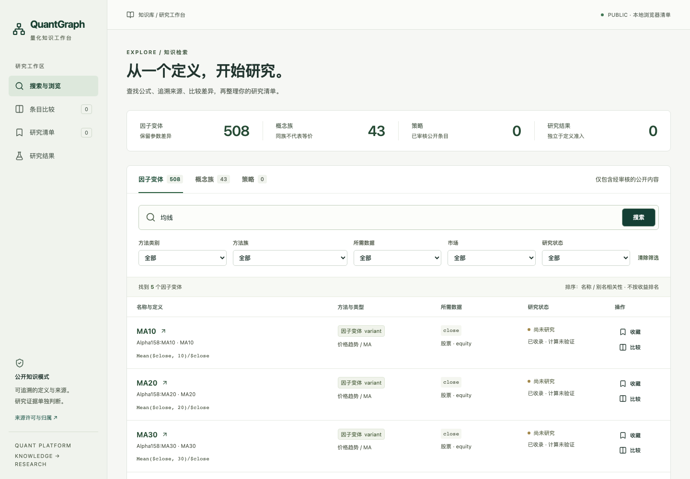
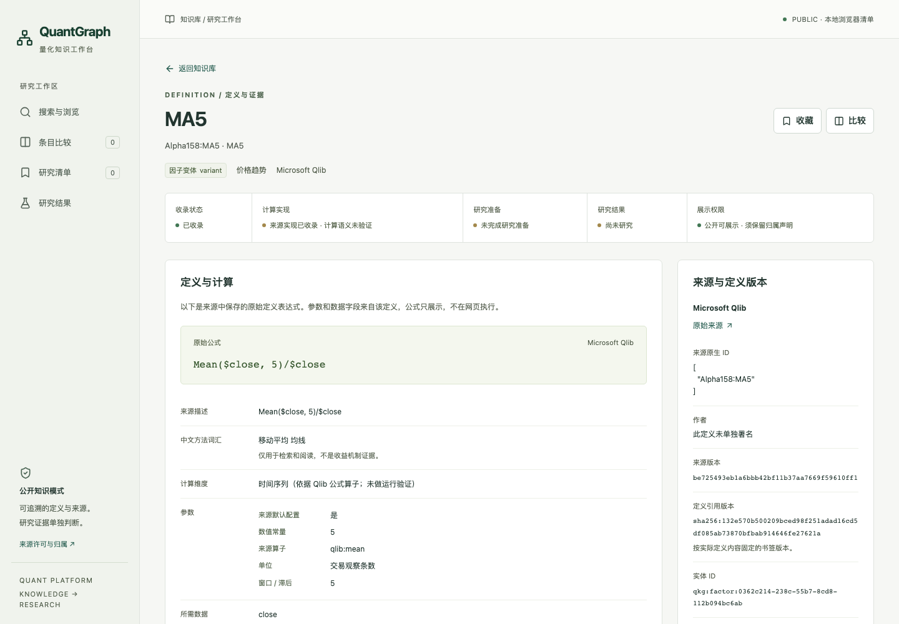
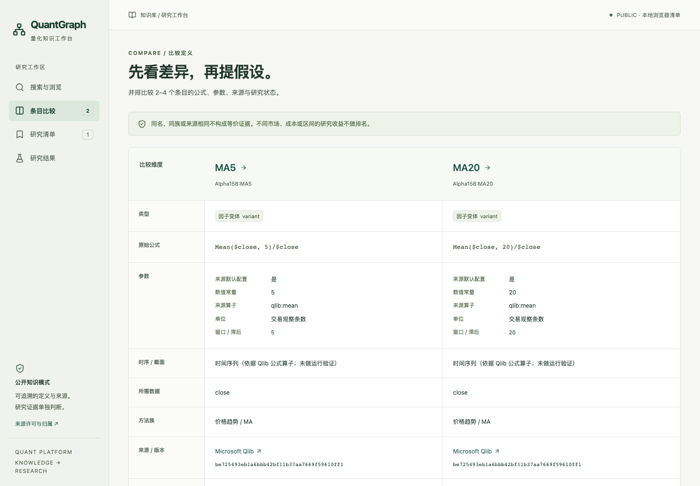
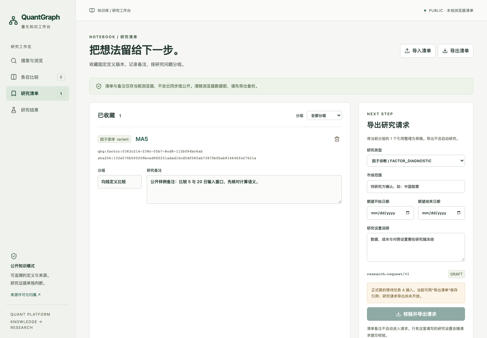

# QuantGraph 网页 MVP

## 产品边界

目标用户是需要追溯因子定义、核对参数差异、整理复现问题的量化研究员、研究工程师和学习者。网页是知识工作台，不提供交易建议、执行公式、启动研究或策略发布。

三个主要场景：

1. 用中文方法词汇、英文名称或来源别名找到定义，查看原始公式、数据字段、固定来源版本与许可。
2. 对照 2–4 个概念或变体，核对窗口、公式、数据需求和实现位置，明确哪些差异尚无等价证据。
3. 按研究问题收藏固定版本引用，添加本地备注和分组，导入/导出清单，再由正式契约输出研究请求。

## 当前可用与限制

| 功能 | 状态 |
|---|---|
| 中文/英文/别名/描述搜索、筛选、分页 | 接真实许可安全公开 release |
| 概念、变体、策略分别浏览 | 可用；公开策略数量由数据库返回，当前无记录 |
| 详情、来源与关系证据 | 可用；经济逻辑缺失时明确留空 |
| 2–4 项比较 | 可用；不生成等价结论或收益排行榜 |
| 收藏、取消、分组、备注、刷新保留 | 可用；只存当前浏览器，无云同步 |
| 清单 JSON 导入/导出 | 可用；导入引用经真实公开 API 校验，旧版本拒绝自动替换 |
| 正式研究请求导出 | **未完成：等待任务 A 的 research-request/v1 正式 schema/API** |
| 研究结果 | 真实公开查询为空；四类证据解释可用，正式 factor-study-result/v1 尚未接入 |
| PRIVATE 网站、多用户账户、支付 | 未实现；本轮网站只支持 PUBLIC 本地部署 |

没有生产 mock、硬编码收益指标或虚构使用量。故障注入、恶意文本和损坏存储只存在于明确命名的测试中。清单导出是 `quantgraph-list/v1` 备份，不能冒充 `research-request/v1`。任务 A 缺席时，正式请求按钮关闭，服务端返回 503；不创建另一套研究 schema，也不把 BacktestResult 重新标记成确认性研究。

清单的 `entity_type + entity_id + definition_revision` 固定引用实际公开定义。当前源实体尚无正式 definition_revision，网页用去除收录时间后的规范化定义 SHA-256 作为本地书签身份；任务 A 接入时必须复核身份映射，不能默默改写历史引用。更新公开 release 后，旧引用保留原值，导入/请求需要显式解决版本变化。

## 商业假设，尚待验证

免费知识检索、出处追溯和个人本地清单有助于用户判断资料是否值得研究。未来可能收费的能力包括团队协作、可审计的研究记录管理和经过许可审核的研究结果检索。这些只是产品假设，不代表取得语料商业权利、已有付费客户或已验证用户愿意付费。技术 API 的 commercial profile 仅表示现有记录权限筛选。

需要用真实用户验证：

- 用户能否在不看帮助的情况下找到一个因子，并说清概念族与参数变体的区别？
- 公式、数据字段和来源版本是否足以提出可复现的研究问题？哪些中文解释确实缺失？
- 用户是否理解“已收录”“计算未验证”“尚未研究”是不同状态？
- 2–4 项比较是否能避免误把同族关联看成数学等价？
- 本地清单及 JSON 备份是否够用？多人协作与历史版本迁移的真实频率如何？
- 正式请求接入后，有多少请求能被研究方完整理解？哪些设置应由研究端补充或拒绝？

## 本地启动与开发

要求 Python 3.11+、uv、Node.js 22+、npm。仓库根目录一条命令：

```sh
bash web/start.sh
```

浏览器打开 `http://127.0.0.1:8765`。同一个 FastAPI 进程提供 Graph API、网页 adapter 和编译后的 React 文件。启动使用此 worktree 的 `.venv`、`web/node_modules` 与 `web/dist`；只绑定回环地址。可用 `QUANTGRAPH_WEB_PORT=另一个端口 bash web/start.sh` 为其他独立 checkout 分配端口。禁止共用可写数据库。

热更新开发时先启动后端，再运行 `npm --prefix web run dev`，Vite 固定 `127.0.0.1:5178`，代理到 `8765`。正式本地验收用生产构建与同源 `8765`。E2E 使用独立 `8766`，不复用已运行服务。

```sh
uv sync --frozen --extra test
npm --prefix web ci
npm --prefix web run lint
npm --prefix web run typecheck
npm --prefix web test
npm --prefix web run build
PLAYWRIGHT_BROWSERS_PATH="$PWD/web/.artifacts/browsers" node web/node_modules/@playwright/test/cli.js install chromium
PLAYWRIGHT_BROWSERS_PATH="$PWD/web/.artifacts/browsers" npm --prefix web run e2e
uv run pytest tests/test_web.py tests/test_public.py tests/test_formula.py -q
uv run quantgraph build-public
uv run quantgraph verify-public
```

E2E 日志、下载、浏览器和截图保存在 `web/.artifacts`、`web/test-results`，不提交本机日志。只可将人工检查后的公开截图复制到产品文档目录。生产构建关闭 source map；不包含数据文件、测试 fixture、账户密钥或环境配置。

## API 与隔离

Graph 查询继续使用 `/v1`，API 应用版本 `0.2.0`；只读网页投影为 `/v1/web`，`web-read/v1`。现有 API factory 只新增向后兼容的 `public_only` 可选参数，默认保持旧行为；网页入口固定开启该参数。

| 端点 | 用途 |
|---|---|
| GET /v1/web/meta | 公开数量、筛选项、release、契约接入状态 |
| GET /v1/web/search | 分类型搜索、筛选与分页；精确名称/别名优先，再按名称排序 |
| GET /v1/web/entities/{kind}/{id} | 定义、来源、实现和有证据关系 |
| GET /v1/web/compare?ref=kind/id&ref=kind/id | 比较 2–4 条真实定义 |
| POST /v1/web/references/resolve | 仅校验公开 ID 与版本；不接收清单备注 |
| GET /v1/web/results | 当前公开结果查询与契约状态 |
| POST /v1/web/research-requests | 契约未接入时明确 503；不会执行研究 |
| GET /v1/web/license | 当前 release 的 Microsoft MIT 完整声明 |

网页启动先运行现有 `verify_public`，再用现有只读 FactorDB 打开经审核的 `datasets/public` SQLite。不会读 curated/current、私有 ingestion 或环境指定的 research profile。客户端添加 profile/mode/database 参数无法改变固定数据源；旧 Graph 路由也共享这一公开数据库。关系仅保留公开端点；计数与筛选从同一公开子图计算。

公开定义的许可不授权底层行情，也不自动授权研究结果。来源只以 React 文本节点呈现；不使用 HTML 注入、Markdown HTML、公式求值或任意 Python。链接只接受无凭据的 HTTP(S)，外链隔离 opener。生产响应设置 CSP、nosniff、referrer 和权限策略；仅允许本地 Host，未知 API 路径不会回退成首页。旧 ingestion API 不在网页应用注册，密钥不进入浏览器。

本地清单存储键包含 PUBLIC，导入必须显式声明 PUBLIC。存储损坏时保留原字节，不静默清空；存储被拒绝时显示未保存。导入只把实体引用送给当前同源服务校验，备注/分组留在浏览器，不进入公共统计或搜索。

## 正式契约接入剩余工作

任务 A 交付后：复用其 schema 与实体版本解析，接真实请求生成/校验接口；按明确许可规则读取结果，展示方法、区间、成本、指标、限制与结论类别；补齐真实请求导出→生产 schema 校验和真实结果记录的契约测试。当前依赖未满足，不能宣布完整 MVP 成功标准通过。

## 本轮验收记录

本地验收日期：2026-09-28。公开 release `d0460076e478321851db`，实际为 **508 个定义变体、43 个概念族、0 个策略、0 个 BacktestResult**。这些是公开子图数量，不是独立盈利因子数量。

- 前端 lint、TypeScript typecheck、格式检查、生产 build 通过；25 个单元测试通过。
- 6 组 Chromium E2E 通过：真实数据完整页面链；英文/别名、分页和空态；API 失败重试；损坏存储与非法导入；恶意来源与非法链接；键盘、表单标签、WCAG AA 自动检查及 390px 窄屏。真实操作链浏览器 console/page errors 为 0。
- Graph 全量公开可运行测试：157 passed / 24 skipped。24 项依赖未分发的混合许可研究快照或私有 archive，未伪造输入补跑。
- `build-public`、`verify-public`、`tests/test_public.py` 通过；公开逻辑数据及 release 没有变化。
- PUBLIC 隔离测试在测试目录放入人工私有 sentinel 数据库，同时设置 research profile 和私有 ingestion 环境：搜索、统计、概念、实体、关系、错误消息都没有泄漏；私有数据库未打开，客户端不能切换 profile，公开快照校验失败时拒绝启动。
- `validate-release` 已执行但未完成：此公开 worktree 没有 source lock 要求的 330 个私有输入，现有离线构建在来源检查处失败。这不是完整私有发布验收通过。
- 正式请求导出/schema 验证与真实研究结果契约验收未完成，仍依赖任务 A。当前可证明的是清单备份→公开 ID/版本校验，不能把它计为研究请求导出通过。

下列截图来自实际公开服务。清单中的备注是标明“公开样例”的测试文字，未使用用户私人笔记。日志、失败 trace 与依赖目录仍在 Git 之外。

| 搜索 | 详情 |
|---|---|
|  |  |

| 比较 | 研究清单 |
|---|---|
|  |  |

[研究结果真实空状态](screenshots/05-results.png) · [390px 窄屏](screenshots/06-mobile.png)
